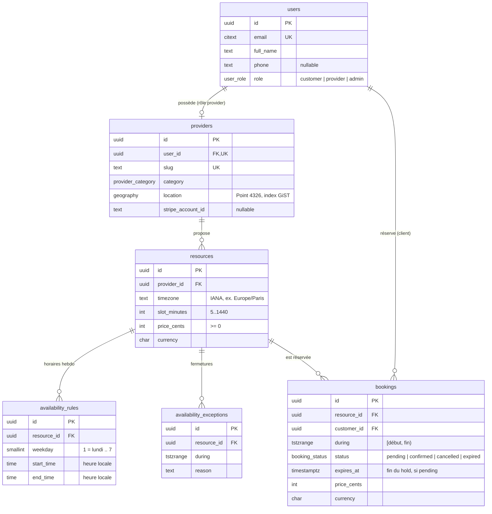

# Schéma de la base de données

PostgreSQL 17 + PostGIS. Schéma source : `packages/db/src/schema/`, migrations : `packages/db/migrations/`.



Toutes les tables ont `created_at` / `updated_at` (`timestamptz`) sauf les règles et exceptions de disponibilité. Montants en centimes (`integer`), dates en UTC (`timestamptz`), créneaux en `tstzrange` semi-ouverts `[début, fin)`.

## Migrations

| Fichier                                 | Contenu                                        |
| --------------------------------------- | ---------------------------------------------- |
| `0000_extensions.sql` (custom)          | `postgis`, `btree_gist`, `citext`              |
| `0001_initial_schema.sql` (générée)     | tables, enums, clés étrangères, CHECK, index   |
| `0002_bookings_no_overlap.sql` (custom) | contrainte d'exclusion anti double réservation |

## La contrainte `bookings_no_overlap`

```sql
ALTER TABLE bookings ADD CONSTRAINT bookings_no_overlap
  EXCLUDE USING gist (resource_id WITH =, during WITH &&)
  WHERE (status IN ('pending', 'confirmed'));
```

**Ce qu'elle garantit** : deux réservations actives d'une même ressource ne peuvent pas se chevaucher. Postgres le vérifie au moment de l'`INSERT`/`UPDATE`, de façon atomique : même deux requêtes simultanées ne peuvent pas passer toutes les deux. Un contrôle applicatif (« je vérifie que le créneau est libre, puis j'insère ») laisse une fenêtre entre les deux étapes.

- `resource_id WITH =` : même ressource ; `during WITH &&` : créneaux qui se chevauchent.
- `btree_gist` est nécessaire pour mettre un `uuid` (égalité) dans un index GiST avec un `tstzrange`.
- Bornes `[)` : 10h-11h et 11h-12h ne se chevauchent pas.
- **Prédicat partiel** : seules les réservations `pending` (hold de paiement de 15 min) et `confirmed` bloquent le créneau ; une réservation annulée ou expirée le libère.
- Violation → SQLSTATE `23P01` → réponse API `409 SLOT_UNAVAILABLE`.

**Piège du `now()`** : le prédicat d'une contrainte doit être immuable, il ne peut donc pas tester `expires_at > now()`. Un hold expiré bloque le créneau tant que sa ligne n'est pas passée à `expired`. La transaction de réservation commence donc par expirer les holds dépassés qui chevauchent le créneau, puis insère ; le calcul des créneaux libres ignore de lui-même les holds expirés.

**Deadlock** : deux insertions simultanées sur le même créneau peuvent s'attendre mutuellement pendant la vérification de la contrainte ; Postgres interrompt alors l'une d'elles avec `40P01` au lieu de `23P01`. La transaction est rejouée par `retryOnDeadlock` (`packages/db/src/errors.ts`), et le second essai obtient `23P01`. Couvert par `packages/db/test/bookings-constraints.test.ts`.

## Autres contraintes

- `bookings_pending_has_expiry` : un `pending` a toujours un `expires_at`.
- `bookings_during_valid` : créneau non vide et borné.
- `resources_slot_minutes_range`, `*_price_cents_positive`, `availability_rules_weekday_range`, `availability_rules_time_order`.
- Index GiST : `providers_location_gix` (recherche par rayon), `availability_exceptions_resource_during_gix`.
