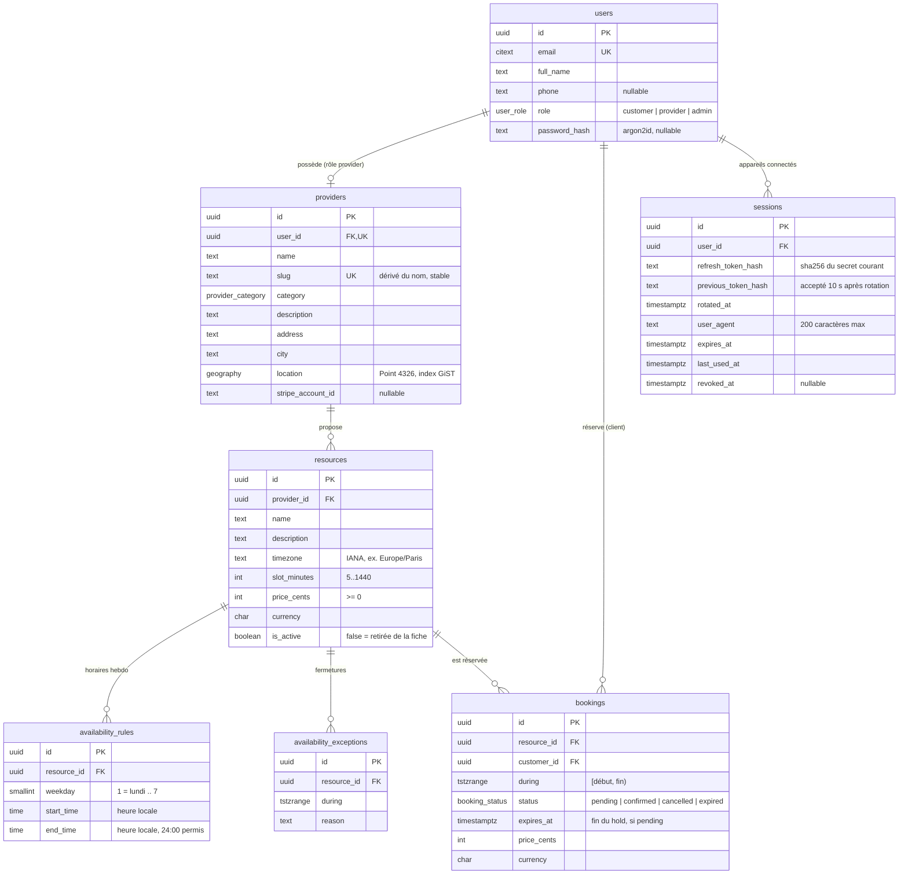

# Schéma de la base de données

PostgreSQL 17 + PostGIS. Schéma source : `packages/db/src/schema/`, migrations : `packages/db/migrations/`.



Toutes les tables ont `created_at` / `updated_at` (`timestamptz`) sauf les règles et exceptions de disponibilité. Montants en centimes (`integer`), dates en UTC (`timestamptz`), créneaux en `tstzrange` semi-ouverts `[début, fin)`.

## Migrations

| Fichier                                             | Contenu                                                                                               |
| --------------------------------------------------- | ----------------------------------------------------------------------------------------------------- |
| `0000_extensions.sql` (custom)                      | `postgis`, `btree_gist`, `citext`                                                                     |
| `0001_initial_schema.sql` (générée)                 | tables, enums, clés étrangères, CHECK, index                                                          |
| `0002_bookings_no_overlap.sql` (custom)             | contrainte d'exclusion anti double réservation                                                        |
| `0003_bookings_constraints_hardening.sql` (générée) | index GiST non partiel sur `bookings (resource_id, during)`, bornes `[)` imposées, format des devises |
| `0004_auth.sql` (générée)                           | `users.password_hash`, table `sessions`                                                               |
| `0005_availability_rules_no_overlap.sql` (custom)   | type `timerange`, contrainte d'exclusion sur les plages horaires d'un même jour                       |

## La contrainte `bookings_no_overlap`

```sql
ALTER TABLE bookings ADD CONSTRAINT bookings_no_overlap
  EXCLUDE USING gist (resource_id WITH =, during WITH &&)
  WHERE (status IN ('pending', 'confirmed'));
```

**Ce qu'elle garantit** : deux réservations actives d'une même ressource ne peuvent pas se chevaucher. Postgres le vérifie au moment de l'`INSERT`/`UPDATE`, de façon atomique : même deux requêtes simultanées ne peuvent pas passer toutes les deux. Un contrôle applicatif (« je vérifie que le créneau est libre, puis j'insère ») laisse une fenêtre entre les deux étapes.

- `resource_id WITH =` : même ressource ; `during WITH &&` : créneaux qui se chevauchent.
- `btree_gist` est nécessaire pour mettre un `uuid` (égalité) dans un index GiST avec un `tstzrange`.
- Bornes `[)` : 10h-11h et 11h-12h ne se chevauchent pas.
- **Prédicat partiel** : seules les réservations `pending` (hold de paiement de 15 min) et `confirmed` bloquent le créneau ; une réservation annulée ou expirée le libère.
- Violation → SQLSTATE `23P01` → réponse API `409 SLOT_UNAVAILABLE`.

**Piège du `now()`** : le prédicat d'une contrainte doit être immuable, il ne peut donc pas tester `expires_at > now()`. Un hold expiré bloque le créneau tant que sa ligne n'est pas passée à `expired`. La transaction de réservation commence donc par expirer les holds dépassés qui chevauchent le créneau, puis insère ; le calcul des créneaux libres ignore de lui-même les holds expirés.

**Deadlock** : deux insertions simultanées sur le même créneau peuvent s'attendre mutuellement pendant la vérification de la contrainte ; Postgres interrompt alors l'une d'elles avec `40P01` au lieu de `23P01`. La transaction est rejouée par `retryOnDeadlock` (`packages/db/src/errors.ts`), et le second essai obtient `23P01`. Couvert par `packages/db/test/bookings-constraints.test.ts`.

## Horaires, fermetures et calcul des créneaux

Les horaires d'une ressource sont des plages hebdomadaires en **heure locale** (`availability_rules` : jour ISO, `start_time`, `end_time`), une ligne par plage ; une pause est le trou entre deux lignes. Les fermetures (`availability_exceptions`) sont des intervalles d'instants (`tstzrange`), saisis en heure locale et convertis par l'API dans le fuseau de la ressource.

```sql
CREATE TYPE timerange AS RANGE (subtype = time);

ALTER TABLE availability_rules ADD CONSTRAINT availability_rules_no_overlap
  EXCLUDE USING gist (resource_id WITH =, weekday WITH =, timerange(start_time, end_time) WITH &&);
```

Deux plages du même jour ne peuvent pas se chevaucher, sinon un créneau serait proposé deux fois. Postgres n'a pas de type « intervalle d'heures » : la migration le crée, sur le modèle de `tstzrange`. `09:00-12:00` et `12:00-14:00` se touchent sans se chevaucher (bornes `[)`). L'API vérifie la même règle avec Zod pour répondre un 400 lisible ; la contrainte est le filet de sécurité. L'horaire d'une ressource est remplacé d'un bloc, dans une transaction qui verrouille la ligne de la ressource.

**Calcul des créneaux** (`apps/api/src/availability/slots.engine.ts`, [ADR 0006](adr/0006-slot-engine.md)) : trois requêtes quel que soit le nombre de jours (règles, fermetures, réservations), puis un calcul en mémoire.

1. Pour chaque jour local, les plages du jour de la semaine sont converties en instants dans le fuseau de la ressource (`24:00` = début du lendemain).
2. Chaque plage est découpée en créneaux de `slot_minutes` minutes **réelles** depuis l'ouverture.
3. Un créneau passé, au-delà de 90 jours ou qui chevauche une fermeture n'est pas proposé.
4. Un créneau qui chevauche une réservation `confirmed`, ou `pending` avec `expires_at > now()`, est proposé avec `available: false`. Un hold expiré est ignoré, même si sa ligne est encore `pending`.

La requête des réservations qui occupent une fenêtre :

```sql
SELECT lower(during), upper(during) FROM bookings
 WHERE resource_id = $1
   AND during && $2::tstzrange
   AND (status = 'confirmed' OR (status = 'pending' AND expires_at > now()));
```

**Hold de paiement** (`POST /v1/bookings`) : dans une même transaction, rejouée par `retryOnDeadlock`, l'API passe à `expired` les holds dépassés qui chevauchent le créneau, puis insère le booking `pending` avec `expires_at = now() + 15 min` (horloge de la base). Un verrou consultatif par client (`pg_advisory_xact_lock`) sérialise ses demandes : la limite de 5 holds actifs tient même face à des requêtes parallèles. C'est `bookings_no_overlap` qui départage deux demandes simultanées : test `apps/api/test/bookings.e2e-spec.ts` (un 201, un 409).

## Recherche par rayon

La position d'un prestataire est un point `geography(Point,4326)` ([ADR 0003](adr/0003-geography-type.md)), indexé en GiST (`providers_location_gix`). La recherche (`apps/api/src/search/search.repository.ts`, [ADR 0007](adr/0007-radius-search.md)) tient en une requête :

```sql
SELECT p.id, p.name, p.slug, p.category, p.address, p.city,
       ST_Y(p.location::geometry) AS latitude,
       ST_X(p.location::geometry) AS longitude,
       round(ST_Distance(p.location, $point))::int AS distance_meters,
       r.min_price_cents, r.resource_count,
       (count(*) OVER ())::int AS total
FROM providers p
JOIN LATERAL (
  SELECT min(price_cents) AS min_price_cents, count(*)::int AS resource_count
  FROM resources
  WHERE provider_id = p.id AND is_active
) r ON r.resource_count > 0
WHERE ST_DWithin(p.location, $point, $radius_m)
  AND p.category = $category
  AND r.min_price_cents <= $price_max
ORDER BY ST_Distance(p.location, $point), p.id
LIMIT $limit;
```

- `$point` vaut `ST_SetSRID(ST_MakePoint(lng, lat), 4326)::geography` : **longitude d'abord**. Une inversion place Paris au large de la Somalie ; un test le vérifie.
- `ST_DWithin(a, b, mètres)` répond « ces deux points sont-ils à moins de N mètres ? ». C'est lui qui utilise l'index : il commence par une comparaison de boîtes englobantes (`location && _st_expand(point, rayon)`), puis vérifie la distance exacte sur les lignes retenues. Filtrer avec `ST_Distance(...) < N` calculerait la distance de chaque ligne de la table.
- `JOIN LATERAL` : la sous-requête peut lire la ligne `p` en cours. Elle calcule le prix minimum et le nombre de ressources actives de chaque prestataire retenu ; `ON r.resource_count > 0` écarte ceux qui n'ont rien à réserver.
- `count(*) OVER ()` est une fonction de fenêtre : elle compte les lignes du résultat avant `LIMIT`, sans seconde requête. L'écran peut ainsi dire « 50 premiers résultats sur 132 ».
- Les conditions de catégorie, de prix et de rayon ne sont ajoutées que si le filtre est fourni. Sans centre : pas de distance, tri par nom.

Plan mesuré sur 50 000 prestataires répartis sur la France (rayon de 10 km autour de Paris, catégorie et prix filtrés) :

```
Bitmap Heap Scan on providers p (actual rows=5)
  Filter: ((category = 'hairdresser') AND st_dwithin(location, …, '10000'))
  Rows Removed by Filter: 22
  ->  Bitmap Index Scan on providers_location_gix (actual rows=27)
        Index Cond: (location && _st_expand(…, '10000'))
Execution Time: 8.654 ms
```

27 lignes lues sur 50 000. Sans centre, la requête parcourt toute la table (0,6 à 0,8 s à ce volume) : limite assumée, notée dans l'ADR 0007.

## Sessions et refresh token rotatif

Une ligne de `sessions` par appareil connecté (supprimée en cascade avec l'utilisateur). Le refresh token envoyé au navigateur vaut `<id de session>.<secret aléatoire de 256 bits>` ; la base ne stocke que `sha256(secret)` : une fuite de la table ne donne aucun token utilisable.

À chaque refresh, le secret est remplacé par un **compare-and-swap** :

```sql
UPDATE sessions
   SET previous_token_hash = refresh_token_hash, refresh_token_hash = $new, rotated_at = now(), …
 WHERE id = $1 AND refresh_token_hash = $presented AND revoked_at IS NULL
RETURNING *;
```

La condition sur `refresh_token_hash` rend la rotation atomique : deux refresh simultanés avec le même token ne peuvent pas réussir tous les deux. Le perdant, ou un onglet en retard, présente alors le hash « précédent » : il est accepté pendant 10 secondes (`rotated_at`), sans émettre de nouveau refresh token. Passé ce délai, un ancien token signale un vol ou un rejeu : `revoked_at` est renseigné et toute la session est invalidée.

Contraintes : `sessions_expiry_after_creation`, `sessions_user_agent_length` (≤ 200). Aucune adresse IP n'est stockée.

## Autres contraintes

- `bookings_pending_has_expiry` : un `pending` a toujours un `expires_at`.
- `bookings_during_valid` / `availability_exceptions_during_valid` : créneau non vide, borné, et toujours `[début, fin)` (même en SQL direct).
- `bookings_currency_format`, `resources_currency_format` : code ISO 4217 (3 majuscules).
- `resources_slot_minutes_range`, `*_price_cents_positive`, `availability_rules_weekday_range`, `availability_rules_time_order`, `availability_rules_no_overlap`.
- `providers_user_id_unique` : un seul profil prestataire par compte ; `providers_slug_unique` : une adresse de fiche publique par prestataire.
- `resources.timezone` n'a pas de contrainte en base (la liste des fuseaux n'est pas immuable) : il est validé par le schéma Zod partagé.
- Index GiST : `providers_location_gix` (recherche par rayon), `availability_exceptions_resource_during_gix`, `bookings_resource_id_during_gix`. Ce dernier complète l'index de l'EXCLUDE, qui est partiel (`pending`/`confirmed`) : il sert la clé étrangère vers `resources` et les requêtes par ressource sur tous les statuts (historique, dashboard, occupation).
